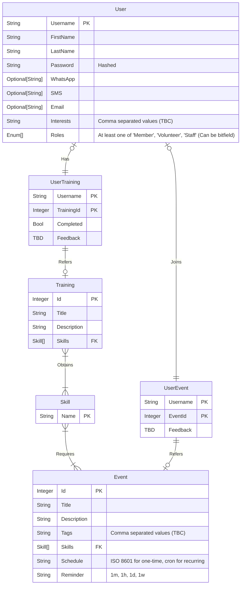

# Server

Server for backend.

## Database Schema

```mermaid
erDiagram
    User {
        String Username PK
        String FirstName
        String LastName
        String Password "Hashed"
        Optional[String] WhatsApp
        Optional[String] SMS
        Optional[String] Email
        String Interests "Comma separated values (TBC)"
        Enum[] Roles "At least one of 'Member', 'Volunteer', 'Staff' (Can be bitfield)"
    }

    UserTraining {
        String Username PK
        Integer TrainingId PK
        Bool Completed
        TBD Feedback
    }

    Training {
        Integer Id PK
        String Title
        String Description
        Skill[] Skills FK
    }

    Skill {
        String Name PK
    }

    UserEvent {
        String Username PK
        Integer EventId PK
        TBD Feedback
    }

    Event {
        Integer Id PK
        String Title
        String Description
        String Tags "Comma separated values (TBC)"
        Skill[] Skills FK
        String Schedule "ISO 8601 for one-time, cron for recurring"
        String Reminder "1m, 1h, 1d, 1w"
    }

    User |o--|| UserTraining: Has
    UserTraining ||--o| Training: Refers
    Training }|--|{ Skill: Obtains
    Skill }|--|{ Event: Requires
    User |o--|| UserEvent: Joins
    UserEvent ||--o| Event: Refers
```